<div align="center">


<br/>


<br/><br/>



<br/><br/>

</div>

---

<br/>

### ⚙️ Tech Arsenal

<div align="center">

<br/>

**Embedded & Microcontrollers**


<br/>

**PCB & Hardware Design**


<br/>

**CAD, Simulation & Manufacturing**


<br/>

**Robotics, Automation & Control**


<br/>

**AI, Vision & Software**


<br/>

</div>

---

<br/>

### 🚀 What I Build

<br/>

| Domain | Stack |
|:---|:---|
| 🤖 **Robotics** | ROS2 · ABB · KUKA · Sensor Fusion · Control Systems · Kinematics |
| 🔌 **Embedded** | STM32 · TI · Embedded C · C++ · UART/SPI/I2C/CAN · RTOS |
| 📐 **Hardware** | KiCad · Altium · SolidWorks · Fusion 360 · ANSYS · 3D Printing |
| 🧠 **AI / ML** | Python · TensorFlow · OpenCV · Scikit-learn |
| ⚙️ **Automation** | PLC Programming · MATLAB · Simulink · Industrial Robots |
| 🎮 **Simulation** | Unity 3D · Gazebo · RViz |

<br/>

---

<br/>

### 📊 GitHub Stats

<br/>

<div align="center">
  

  <br/><br/>

  
  

  <br/><br/>

  
</div>

<br/>

---

<br/>

### 📈 Contribution Activity

<br/>

<div align="center">
  
</div>

<br/>

---

<br/>

### 🏆 Highlights

<br/>

```
🥇  AIR 22         — DD Robocon 2025 (National Robotics Championship)
🤖  Senior Member  — Team Robomanipal, Electronics Division
⚡  Robotics Head  — IE Mechatronics, MIT Manipal
💡  Patent Pending — Tactile Stimulation Toy (Novel HRI Device)
📄  Research x2    — ML for BCG Matrix + Soft Robotic Gripper
🌍  Languages      — Hindi · Marathi · English · Deutsch (lernend)
```

<br/>

---

<br/>

### 🌐 Find Me

<br/>

<div align="center">

[](https://ishandeshmukh.github.io)
[](https://linkedin.com/in/ishan-deshmukh-3b7412247)
[](mailto:ishanmechatronics@gmail.com)

</div>

<br/>

---

<br/>

<div align="center">


<br/><br/>


</div>
